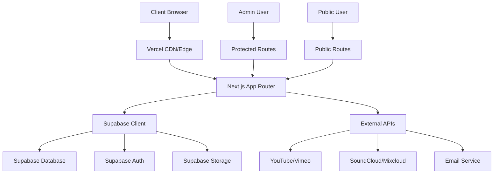

# Design Document

## Overview

The DJ Portfolio Site is a modern, mobile-first web application built with Next.js and deployed on Vercel with Supabase as the backend. The architecture prioritizes performance, scalability, and ease of maintenance while providing a professional platform for DJ marketing and business management.

The system consists of two main interfaces: a public-facing portfolio site for fans and clients, and a protected admin panel for content and request management. The design emphasizes fast loading times, responsive design, and intuitive user experience across all devices.

## Architecture

### High-Level Architecture



### Technology Stack

- **Frontend Framework**: Next.js 14+ with App Router for SSR/SSG capabilities
- **Styling**: Tailwind CSS for rapid, consistent styling
- **Database & Auth**: Supabase (PostgreSQL + Row Level Security)
- **File Storage**: Supabase Storage for images and documents
- **Deployment**: Vercel for seamless Next.js deployment and edge functions
- **Analytics**: Plausible or Umami for privacy-focused analytics
- **Spam Protection**: Cloudflare Turnstile for form protection

### Deployment Architecture

- **Production**: Vercel with custom domain
- **Database**: Supabase hosted PostgreSQL
- **CDN**: Vercel Edge Network for static assets
- **Functions**: Vercel Serverless Functions for API routes

## Components and Interfaces

### Public Components

#### HomePage Component
- Hero section with dynamic content from settings
- Upcoming events display (next 3 gigs)
- Embedded promo video player
- CTA buttons for booking and song requests
- Featured mixes carousel

#### MediaPage Component
- Responsive grid layout for mix embeds
- Image gallery with lightbox functionality
- Platform-specific embed handling (SoundCloud, Mixcloud, YouTube)
- Lazy loading for performance optimization

#### BookingForm Component
- Multi-step form with validation
- Date picker for event scheduling
- Budget range selector
- Spam protection integration
- Success/error state handling

#### SongRequestForm Component
- Simple form with artist/track fields
- Optional event code input
- Rate limiting implementation
- Real-time validation feedback

### Admin Components

#### AdminDashboard Component
- Metrics cards (recent requests, upcoming events)
- Quick action buttons
- Recent activity feed
- Navigation sidebar

#### RequestsManager Component
- Tabbed interface (Bookings/Song Requests)
- Status filtering and sorting
- Bulk actions for request management
- Email template integration

#### ContentEditor Component
- WYSIWYG editor for bio and homepage content
- Image upload with preview
- Mix URL management interface
- File upload for tech rider and press materials

#### EventsManager Component
- Calendar view integration
- CRUD operations for events
- Public/private event toggle
- Venue and timing management

### Shared Components

#### Layout Component
- Responsive navigation header
- Footer with social links
- Mobile menu implementation
- Theme switching capability

#### ThemeProvider Component
- Dark/light mode toggle
- Accent color customization
- CSS custom properties management
- Persistent theme storage

## Data Models

### Database Schema

```sql
-- User management (handled by Supabase Auth)
-- auth.users table provided by Supabase

-- Site configuration
CREATE TABLE public.settings (
    id UUID PRIMARY KEY DEFAULT gen_random_uuid(),
    site_title TEXT,
    hero_heading TEXT,
    hero_sub TEXT,
    logo_url TEXT,
    theme TEXT DEFAULT 'dark',
    socials JSONB DEFAULT '{}'::jsonb,
    rider_file_url TEXT,
    bio TEXT,
    created_at TIMESTAMPTZ DEFAULT NOW(),
    updated_at TIMESTAMPTZ DEFAULT NOW()
);

-- Media content
CREATE TABLE public.mixes (
    id UUID PRIMARY KEY DEFAULT gen_random_uuid(),
    title TEXT NOT NULL,
    platform TEXT CHECK (platform IN ('soundcloud','mixcloud','youtube')),
    url TEXT NOT NULL,
    featured BOOLEAN DEFAULT false,
    display_order INTEGER DEFAULT 0,
    created_at TIMESTAMPTZ DEFAULT NOW()
);

CREATE TABLE public.media_photos (
    id UUID PRIMARY KEY DEFAULT gen_random_uuid(),
    url TEXT NOT NULL,
    alt_text TEXT,
    is_press BOOLEAN DEFAULT false,
    display_order INTEGER DEFAULT 0,
    created_at TIMESTAMPTZ DEFAULT NOW()
);

-- Events and calendar
CREATE TABLE public.events (
    id UUID PRIMARY KEY DEFAULT gen_random_uuid(),
    title TEXT NOT NULL,
    start_at TIMESTAMPTZ NOT NULL,
    end_at TIMESTAMPTZ,
    venue TEXT,
    city TEXT,
    is_public BOOLEAN DEFAULT true,
    status TEXT DEFAULT 'scheduled',
    created_at TIMESTAMPTZ DEFAULT NOW()
);

-- Business requests
CREATE TABLE public.booking_requests (
    id UUID PRIMARY KEY DEFAULT gen_random_uuid(),
    name TEXT NOT NULL,
    email TEXT NOT NULL,
    phone TEXT,
    event_date DATE,
    venue TEXT,
    attendees INTEGER,
    budget_range TEXT,
    message TEXT,
    status TEXT DEFAULT 'new',
    internal_notes TEXT,
    created_at TIMESTAMPTZ DEFAULT NOW()
);

CREATE TABLE public.song_requests (
    id UUID PRIMARY KEY DEFAULT gen_random_uuid(),
    event_id UUID REFERENCES public.events(id),
    requester_name TEXT,
    artist TEXT NOT NULL,
    track TEXT NOT NULL,
    dedication TEXT,
    approved BOOLEAN DEFAULT false,
    created_at TIMESTAMPTZ DEFAULT NOW()
);
```

### Row Level Security Policies

```sql
-- Settings: Admin read/write, public read
ALTER TABLE public.settings ENABLE ROW LEVEL SECURITY;
CREATE POLICY "Public can read settings" ON public.settings FOR SELECT USING (true);
CREATE POLICY "Admin can manage settings" ON public.settings FOR ALL USING (auth.role() = 'authenticated');

-- Mixes: Admin write, public read featured
ALTER TABLE public.mixes ENABLE ROW LEVEL SECURITY;
CREATE POLICY "Public can read featured mixes" ON public.mixes FOR SELECT USING (featured = true);
CREATE POLICY "Admin can manage mixes" ON public.mixes FOR ALL USING (auth.role() = 'authenticated');

-- Events: Admin write, public read public events
ALTER TABLE public.events ENABLE ROW LEVEL SECURITY;
CREATE POLICY "Public can read public events" ON public.events FOR SELECT USING (is_public = true);
CREATE POLICY "Admin can manage events" ON public.events FOR ALL USING (auth.role() = 'authenticated');

-- Requests: Admin only
ALTER TABLE public.booking_requests ENABLE ROW LEVEL SECURITY;
CREATE POLICY "Admin can manage booking requests" ON public.booking_requests FOR ALL USING (auth.role() = 'authenticated');

ALTER TABLE public.song_requests ENABLE ROW LEVEL SECURITY;
CREATE POLICY "Admin can manage song requests" ON public.song_requests FOR ALL USING (auth.role() = 'authenticated');
```

## Error Handling

### Client-Side Error Handling
- Form validation with Zod schemas
- Network error recovery with retry logic
- User-friendly error messages
- Loading states for all async operations
- Graceful degradation for media embeds

### Server-Side Error Handling
- API route error boundaries
- Database connection error handling
- Rate limiting with appropriate HTTP status codes
- Logging integration for debugging
- Fallback responses for external API failures

### Error Monitoring
- Integration with Vercel Analytics for error tracking
- Custom error pages (404, 500)
- Client-side error boundary components
- Performance monitoring for Core Web Vitals

## Testing Strategy

### Unit Testing
- Component testing with React Testing Library
- API route testing with Jest
- Database query testing with Supabase test client
- Form validation testing
- Utility function testing

### Integration Testing
- End-to-end user flows with Playwright
- Admin workflow testing
- Form submission and email notification testing
- Authentication flow testing
- Media embed functionality testing

### Performance Testing
- Lighthouse CI integration
- Core Web Vitals monitoring
- Database query performance testing
- Image optimization validation
- Mobile performance testing

### Security Testing
- Rate limiting validation
- Spam protection testing
- Authentication boundary testing
- SQL injection prevention validation
- XSS protection verification

## Performance Optimizations

### Frontend Optimizations
- Next.js Image component for automatic optimization
- Lazy loading for media embeds and images
- Code splitting with dynamic imports
- Service worker for offline functionality
- Critical CSS inlining

### Backend Optimizations
- Database indexing on frequently queried columns
- Connection pooling with Supabase
- Caching strategies for static content
- CDN utilization through Vercel Edge Network
- API response compression

### SEO Optimizations
- Server-side rendering for public pages
- Dynamic meta tags and Open Graph data
- Structured data markup for events
- XML sitemap generation
- Robots.txt configuration

## Security Considerations

### Authentication & Authorization
- Supabase Auth with email magic links
- Row Level Security for data access control
- Admin role verification for protected routes
- Session management and token refresh

### Data Protection
- Input sanitization and validation
- SQL injection prevention through Supabase client
- XSS protection with Content Security Policy
- HTTPS enforcement
- Secure file upload handling

### Spam Prevention
- Cloudflare Turnstile integration
- Rate limiting on form submissions
- Email validation and verification
- Honeypot fields for bot detection
- IP-based request throttling